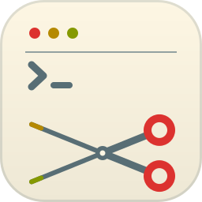

<p align="center">
  
</p>

<h1 align="center">clipper</h1>

<p align="center">
  <b>The Flipper Zero CLI — over Bluetooth.</b><br>
  Like <code>screen /dev/cu.usbmodem*</code>, but cordless.
</p>

<p align="center">
  <a href="https://skycocker.github.io/clipper/">Website</a> ·
  <a href="https://github.com/skycocker/clipper/releases/latest">Releases</a> ·
  <a href="#install--getting-started">Install</a>
  <br>
  
  
</p>

---

## why?

didn't you ever want to actually use your flipper to do something apart from
replaying your neighbour's keyfob? also, it's not exactly the most practical
thing in the world to line up a 20-metre usb wire to your laptop in front of the
security guard. joking, of course. also — much easier to let claude code execute
~~fuzzy scanning~~ reasoning using the device.

## Install / getting started

Grab the binary for your OS and the `.fap` from
[Releases](https://github.com/skycocker/clipper/releases). The client works with
**any** Flipper Zero running the plugin — it matches on the plugin's advertised
name (`CLIpper`) / service UUID, not on your device's Bluetooth name, so there's
nothing device-specific to configure.

**macOS:** the binary is unsigned, so the first run is blocked by Gatekeeper.
Clear the quarantine flag once after extracting:
```
tar -xzf clipper-*-apple-darwin.tar.gz
xattr -dr com.apple.quarantine ./clipper   # or: right-click → Open
./clipper
```

**Plugin:** copy `clipper-<version>.fap` to `/ext/apps/Bluetooth/clipper.fap`
on the SD card (via qFlipper or the mobile app), then launch it from
**Apps → Bluetooth → CLIpper BLE Shell** on the device.

First connect pops a system pairing dialog on the Mac and a 6-digit numeric
comparison prompt on the Flipper. Confirm on both. Once bonded, subsequent
runs are silent.

> The `.fap` is built against a specific firmware API level. It's verified on
> Momentum `mntm-012` and official `1.4.x`. On a very different firmware you
> may need to rebuild it from source (below).

### Build from source

**Prereqs:**
- Rust (any stable >= 1.75)
- Python 3.12 + [uv](https://docs.astral.sh/uv/) — only for the diagnostic scripts
- [`ufbt`](https://github.com/flipperdevices/flipperzero-ufbt) — only to build/flash the plugin
- A Flipper Zero (any firmware that ships the modern `cli_shell_alloc` API — Momentum tested)

**1. Build and flash the plugin** (USB cable):
```
cd plugin
ufbt launch     # builds, copies to /ext/apps/Bluetooth/clipper.fap, and launches it
```

The plugin's screen should show "CLIpper / BLE CLI: ready / Back to exit".

**2. Build and run the client:**
```
cd client
cargo run --release
```

## Usage

```
clipper [NAME]                 # interactive shell in this terminal
clipper --listen ADDR [NAME]   # serve the shell on a TCP socket
```

```
$ clipper
clipper: scanning 12s for "CLIpper"...
clipper: match name="CLIpper" svc=yes rssi=Some(-42)
clipper: connecting...
clipper: connected — type to send, Ctrl+] (or Ctrl+\, Ctrl+D) to exit.

CLIpper :: BLE CLI shell

>: ps
Name                           Stack
DesktopSrv                     2048
GuiSrv                         2048
...
>:
```

- `NAME`: advertised-name substring to match (default `CLIpper`); the `0x3081`
  service UUID is also matched, so the default works for any device running the
  plugin even if the advertised name is truncated.
- `-l, --listen ADDR`: bind a TCP listener. `ADDR` is `PORT` (binds `127.0.0.1`
  only) or `IP:PORT`.
- `CLIPPER_SCAN_DEBUG=1`: dump every BLE peripheral seen while scanning.

**Exit keys** (any of these work; we accept several because terminal emulators
sometimes intercept individual control bytes):
- `Ctrl+]` — telnet-style escape
- `Ctrl+\` — file separator
- `Ctrl+D` — EOT

`Ctrl+C` is forwarded to the Flipper as 0x03 so you can interrupt a running
command without killing the local client.

The shell shares the device's main CLI command registry **and** its external
command config, so both built-in commands (`storage`, `ps`, `gpio`, …) and
external `.fal` commands work — including the interactive sub-shells. For
example, to drive NFC over Bluetooth:

```
>: nfc
[nfc]>: scanner      # or: emulate / apdu / dump / raw / mfu / field
```

This is the intended way to debug NFC interactions cordlessly: run clipper as
the foreground app and drive `nfc` from the BLE shell. (Only one Flipper app
runs at a time, so this *replaces* the dedicated NFC app rather than running
alongside it.)

## Remote / network access (`--listen`)

Run the client on the machine that's near the Flipper, and drive it from
anywhere over TCP — handy for scripting or letting an agent (e.g. Claude Code)
run experiments against the CLI:

```
# on the machine with the Flipper (BLE host):
clipper --listen 2323            # binds 127.0.0.1:2323

# from your laptop — tunnel the port over SSH, then talk to it:
ssh -L 2323:127.0.0.1:2323 ble-host
nc 127.0.0.1 2323
>: storage list /ext
>: nfc
[nfc]>: scanner
```

It bridges **one TCP client at a time** to the Flipper (the device has a single
CLI session); BLE is connected fresh per client and dropped when the client
disconnects, so each connection gets a clean shell. Send `0x03` (Ctrl+C) as a
raw byte to interrupt a running remote command; close the socket to end the
session.

> ⚠️ **Security.** Anyone who can reach the port gets full control of the
> Flipper CLI (`storage`, `badusb`, `subghz`, …). A bare `PORT` binds loopback
> on purpose — keep it that way and reach it over an **SSH tunnel** rather than
> binding `0.0.0.0`. clipper prints a warning if you bind a non-loopback address.

## How it works

The Flipper has a great CLI accessible over its USB CDC interface (`storage`,
`subghz`, `nfc`, `gpio`, `bt`, `ps`, etc.). Over Bluetooth, the stock firmware
exposes the *same serial endpoint* — but routes every byte to a protobuf-RPC
subsystem instead of the CLI shell. So no interactive shell over BLE without
something on both ends.

`clipper` is that something. A small Flipper `.fap` plugin reroutes the
BLE serial endpoint to a real `cli_shell_alloc()` session, and a host-side
Rust binary opens a raw-mode TTY that pipes to/from it.

## Project layout

| Dir | What |
|---|---|
| `plugin/` | The Flipper `.fap`. Registers its own `FuriHalBleProfileTemplate` reusing the stock `BleServiceSerial` shape so existing clients (any "Flipper serial over BLE" tool) work too. |
| `client/` | The Rust binary. `btleplug` + `tokio` + `crossterm`. |
| `tools/` | Diagnostic Python scripts: `scan.py` (BLE scan), `flipper_cli.py` (drive Flipper over USB), `test_reconnect.py` (hardware integration test). |

## Platforms

| OS | Status |
|---|---|
| macOS (Apple Silicon & Intel) | **Tested.** Primary target, used daily — pairing, bridge, NFC subshell, reconnect. |
| Linux (x86_64) | **Build + BLE scan verified** on Ubuntu 24.04 / BlueZ 5.72 (live scan enumerates devices; unit tests pass). End-to-end connect/pair to a Flipper not yet exercised on Linux. First-time pair via `bluetoothctl pair <addr>`. |
| Windows 11 | **Experimental** — CI-built, not yet hardware-tested. Reports welcome. |

## Diagnostics / hardware tests (`tools/`)

- `scan.py` — list nearby BLE devices.
- `flipper_cli.py "<cmd>"` — run a command on the Flipper's **USB** CLI (e.g. `"loader open …"`, `"input send back short"`); used to drive the device in tests without touching it.
- `serial_capture.py` / `log_capture.py` — capture the Flipper's USB console / `log trace` stream across a crash+reboot (the reboot renumerates USB; these reopen it). Invaluable for locating faults without an SWD probe.
- `spike_smoke.py` — bleak-based connect + `help` round-trip check.
- `test_reconnect.py` — end-to-end reconnect integration test.

## Known limitations

- **Slow disconnect detection on macOS.** When the plugin exits without
  sending a graceful link-layer termination (which happens any time the
  user presses Back), macOS / CoreBluetooth / `btleplug` can take many
  seconds to surface the disconnect. The reconnect loop kicks in once it
  does. Linux/BlueZ does not have this latency.
- **Advertised name truncates by one byte on stock firmware.** We work
  around it by also matching by service UUID `0x3081`.
- **`nfc scanner` can crash the Flipper on certain tags — this is an upstream
  firmware bug, not clipper.** Some NFC tag types (e.g. MIFARE Classic /
  ISO‑14443‑3A) make Momentum's `nfc` CLI fault with a `NULL pointer
  dereference` the moment the tag is detected. It is **reproducible over plain
  USB with no app and no clipper running**, and the NFC GUI app reads the same
  hardware fine — so the bug lives in the firmware's NFC *CLI* path, not here.
  clipper just faithfully relays the command. Other tag types (e.g.
  ISO‑14443‑4A) scan fine over BLE. Verified on Momentum `mntm-012`. If you hit
  it, report it to [Momentum](https://github.com/Next-Flip/Momentum-Firmware/issues),
  not clipper. (Related upstream NFC null-deref reports:
  [#3483](https://github.com/flipperdevices/flipperzero-firmware/issues/3483),
  [#3338](https://github.com/flipperdevices/flipperzero-firmware/issues/3338),
  [#3203](https://github.com/flipperdevices/flipperzero-firmware/issues/3203).)

## Development

```
# rust unit tests + clippy
cd client
cargo test
cargo clippy --all-targets -- -D warnings
cargo fmt --check

# plugin build (no-flash)
cd plugin
ufbt

# hardware integration tests (needs Flipper connected via USB)
uv run tools/test_reconnect.py
```

CI runs `cargo fmt`/`clippy`/`test` on the `{ubuntu, macos, windows}-latest` runner matrix and builds the plugin on Ubuntu via `ufbt`.

## License

**GPL-3.0-or-later** — see [LICENSE](LICENSE), © [skycocker](https://github.com/skycocker).
Copyleft fits here: the Flipper firmware clipper's plugin builds on (OFW and
Momentum) is itself GPLv3, and the Rust client's dependencies (MIT/Apache-2.0)
are compatible. Fork it, ship it, build on it — just keep derivatives open.
